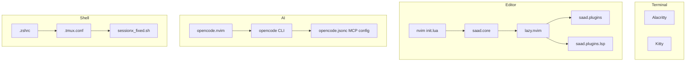
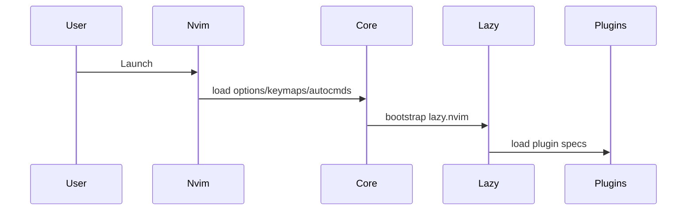
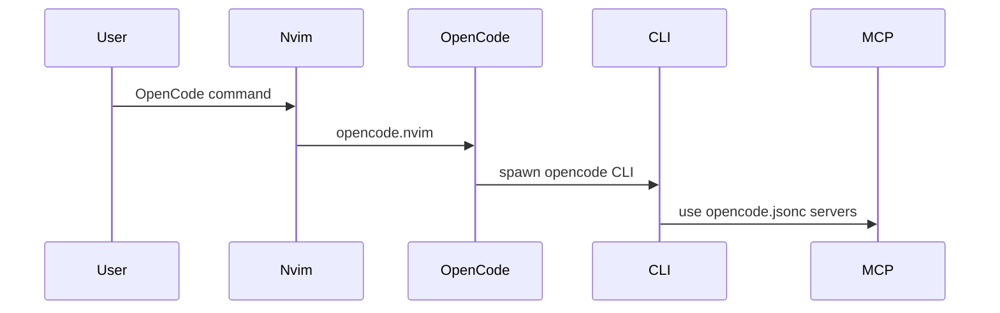
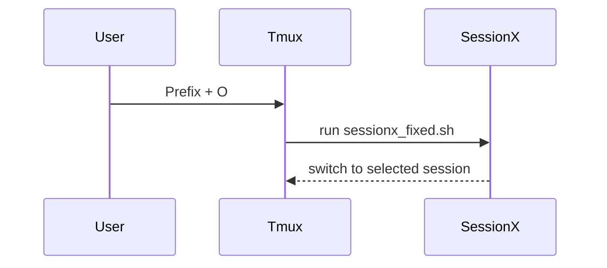

# Codebase Map

> Auto-generated by Cartographer. Last mapped: 2026-03-04T16:11:50Z

## System Overview

Dotfiles repo centered on a modular Neovim setup (lazy.nvim), with terminal theming (Alacritty/Kitty), tmux workflow tooling, Zsh shell customization, and OpenCode MCP configuration. The main config flow starts at Neovim `init.lua`, loads core settings, then lazy.nvim plugin specs.



## Directory Structure

```
.
|- alacritty/.config/alacritty.toml       # Alacritty UI, font, window
|- kitty/.config/kitty/                   # Kitty base config + theme
|- mise/.config/mise/config.toml          # Mise config (empty placeholder)
|- nvim/.config/nvim/                     # Neovim config root
|  |- init.lua                            # Entry point
|  |- lua/saad/core/                       # Options, keymaps, autocmds
|  |- lua/saad/plugins/                    # Lazy plugin specs
|  |- lua/saad/plugins/lsp/                # LSP setup + tooling
|  |- lua/saad/disabled/                   # Disabled plugin specs
|  |- lua/secrets.lua.example              # Secrets template
|- opencode/opencode.jsonc                # OpenCode MCP server config
|- tmux/.tmux.conf                         # Tmux configuration
|- tmux/sessionx_fixed.sh                  # Session switcher script
|- zshrc/.zshrc                            # Shell config
|- opencode.sh                             # OpenCode setup script
|- docs/                                   # Documentation (this map)
|- README.md                               # Setup instructions
|- context.md                              # Detailed project context
|- servidormcp.md                          # MCP server guide
|- GIT_WARNING.md                          # Git safety policy
|- .gitignore                              # Repo ignores
```

## Module Guide

### Neovim Core

**Purpose**: Editor defaults, keymaps, and core autocmds.
**Entry point**: `nvim/.config/nvim/init.lua`
**Key files**:
| File | Purpose | Tokens |
| --- | --- | --- |
| `nvim/.config/nvim/init.lua` | Entry point + macro notify | 178 |
| `nvim/.config/nvim/lua/saad/core/options.lua` | Global options | 362 |
| `nvim/.config/nvim/lua/saad/core/keymaps.lua` | Keymaps + LSP binds | 1065 |
| `nvim/.config/nvim/lua/saad/core/api.lua` | Autocmds, highlights | 124 |

**Exports**: No public exports; all side-effect configuration.
**Dependencies**: Neovim API.
**Dependents**: lazy.nvim plugin setup.

### Neovim Plugins (lazy.nvim)

**Purpose**: Plugin specs for UI, editing, git, AI, and utilities.
**Entry point**: `nvim/.config/nvim/lua/saad/lazy.lua`
**Key files**:
| File | Purpose | Tokens |
| --- | --- | --- |
| `nvim/.config/nvim/lua/saad/lazy.lua` | Lazy bootstrap + imports | 163 |
| `nvim/.config/nvim/lua/saad/plugins/opencode.lua` | OpenCode integration | 1288 |
| `nvim/.config/nvim/lua/saad/plugins/formatting.lua` | Conform formatting | 518 |
| `nvim/.config/nvim/lua/saad/plugins/linting.lua` | nvim-lint setup | 752 |
| `nvim/.config/nvim/lua/saad/plugins/colorscheme.lua` | Catppuccin theme | 193 |

**Exports**: Lazy plugin specs (tables).
**Dependencies**: lazy.nvim, plugin ecosystems (plenary, devicons, etc.).
**Dependents**: All editing workflows in Neovim.

### LSP and Tooling

**Purpose**: LSP server setup and tool installation.
**Entry point**: `nvim/.config/nvim/lua/saad/plugins/lsp/lspconfig.lua`
**Key files**:
| File | Purpose | Tokens |
| --- | --- | --- |
| `nvim/.config/nvim/lua/saad/plugins/lsp/mason.lua` | Ensure tools | 492 |
| `nvim/.config/nvim/lua/saad/plugins/lsp/lspconfig.lua` | LSP setup | 2635 |

**Exports**: Lazy specs configuring LSP servers and tooling.
**Dependencies**: mason.nvim, nvim-lspconfig, cmp-nvim-lsp, neodev.
**Dependents**: Completion, diagnostics, formatting/linting.

### OpenCode + MCP

**Purpose**: AI assistant integration and MCP server configuration.
**Entry points**: `nvim/.config/nvim/lua/saad/plugins/opencode.lua`, `opencode/opencode.jsonc`
**Key files**:
| File | Purpose | Tokens |
| --- | --- | --- |
| `nvim/.config/nvim/lua/saad/plugins/opencode.lua` | OpenCode Neovim setup | 1288 |
| `opencode/opencode.jsonc` | MCP servers config | 630 |
| `nvim/.config/nvim/lua/secrets.lua.example` | API key template | 171 |

**Exports**: Neovim user commands and keymaps.
**Dependencies**: OpenCode CLI, Node, configured MCP servers.
**Dependents**: AI workflows inside Neovim/terminal.

### Terminal and Shell

**Purpose**: Terminal UX and shell environment.
**Entry points**: `alacritty/.config/alacritty.toml`, `kitty/.config/kitty/kitty.conf`, `zshrc/.zshrc`
**Key files**:
| File | Purpose | Tokens |
| --- | --- | --- |
| `alacritty/.config/alacritty.toml` | Alacritty settings | 167 |
| `kitty/.config/kitty/kitty.conf` | Kitty settings | 118 |
| `zshrc/.zshrc` | Shell config | 971 |

**Dependencies**: Nerd Fonts, zoxide, fzf, oh-my-zsh, optional tools.
**Dependents**: All terminal workflows.

### Tmux Workflow

**Purpose**: Session and pane management, theme, plugins.
**Entry point**: `tmux/.tmux.conf`
**Key files**:
| File | Purpose | Tokens |
| --- | --- | --- |
| `tmux/.tmux.conf` | Tmux config | 1360 |
| `tmux/sessionx_fixed.sh` | Session switcher | 317 |

**Dependencies**: tmux, TPM, fzf, tmux-sessionx (optional for preview).
**Dependents**: tmux keyboard-driven workflow.

### Docs and Scripts

**Purpose**: Setup and reference documentation, helper script.
**Key files**:
| File | Purpose | Tokens |
| --- | --- | --- |
| `README.md` | Setup instructions | 629 |
| `context.md` | Full project context | 6258 |
| `servidormcp.md` | MCP guide | 2906 |
| `opencode.sh` | Setup script | 5202 |
| `GIT_WARNING.md` | Git rules | 258 |

## Data Flow







## Conventions

- Neovim uses Lua-only configuration, modularized under `nvim/.config/nvim/lua/saad/`.
- Plugins are defined as lazy.nvim specs in `nvim/.config/nvim/lua/saad/plugins/`.
- Disabled plugins live in `nvim/.config/nvim/lua/saad/disabled/`.
- Secrets are stored in `nvim/.config/nvim/lua/secrets.lua` and ignored by git.
- Documentation and setup guides are maintained at repo root.

## Gotchas

- `nvim/.config/nvim/lua/saad/core/keymaps.lua` and `nvim/.config/nvim/lua/saad/plugins/rename.lua` both map `<leader>rn`.
- `nvim/.config/nvim/lua/saad/core/options.lua` sets `background=dark` while Catppuccin uses `latte`.
- `nvim/.config/nvim/.luarc.json` includes machine-specific paths.
- `opencode/opencode.jsonc` includes a Context7 API key string; keep it non-sensitive or rotate.

## Navigation Guide

**To add a new Neovim plugin**: create a spec in `nvim/.config/nvim/lua/saad/plugins/` and let `nvim/.config/nvim/lua/saad/lazy.lua` import it automatically.

**To change LSP servers or tools**: update `nvim/.config/nvim/lua/saad/plugins/lsp/mason.lua` and `nvim/.config/nvim/lua/saad/plugins/lsp/lspconfig.lua`.

**To update OpenCode MCP servers**: edit `opencode/opencode.jsonc` and review `servidormcp.md`.

**To adjust tmux keys or themes**: edit `tmux/.tmux.conf`; update session switcher in `tmux/sessionx_fixed.sh`.

**To update shell env**: edit `zshrc/.zshrc`.
